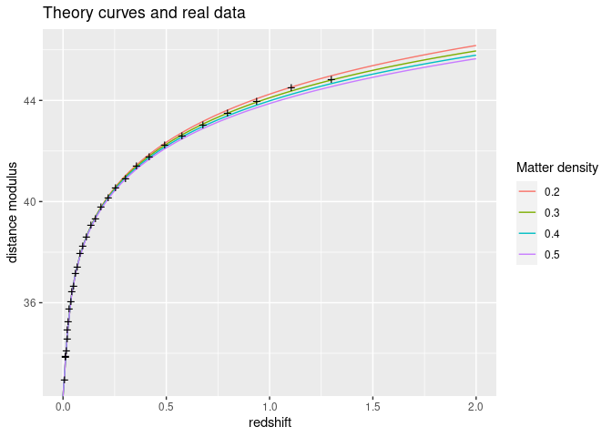
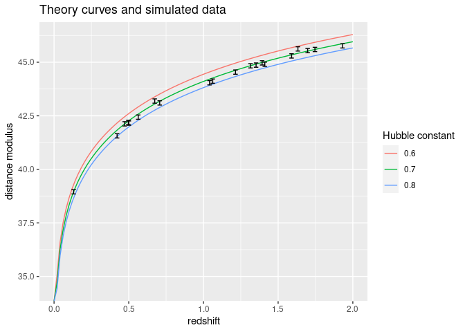

Preliminary Task
================
Joe Marsh Rossney
2022-09-11

This exercise is based around the relationship between the apparent
brightness and distance of Type IA Supernovae. These are ‘standard
candles’ with an absolute magnitude profile that is theoretically
well-understood.

In this exercise we are given a dataset of 31 measurements of ‘distance
modulus’ $\mu$ (a logarithmic distance measure) of IA Supernovae at
various redshifts $z$. We are also given a theoretical model for
$\mu(z)$. The goal is to infer the free parameters of the model using
the data.

## Theory

The following model predicts the distance modulus of Type IA Supernovae
given ther redshift and has two free parameters: the Hubble constant and
the matter density.

-   Distance modulus: $\mu$
-   Redshift: $z \in \mathbb{R}^+$
-   Hubble constant: $h \in [0, 1]$
-   Matter density parameter: $\Omega_m \in [0, 1]$

$$
\mu(z) = 25 - 5\log_{10}h + 5\log_{10}(D_L^\star(z))
\tag{1}
$$

``` r
compute_mu <- function(z, omega, h=0.7) {
  result <- 25 - 5 * log10(h) + 5 * log10(D_L(z, omega))
  return(result)
}
```

$$
D_L^\star(z) = 3000(1 + z) \left[ \eta(1, \Omega_m) - \eta \left(\frac{1}{1+z}, \Omega_m\right) \right]
\tag{2}
$$

``` r
D_L <- function(z, omega) {
  result <- 3000 * (1 + z) * (
    eta(1, omega) - eta(1 / (1 + z), omega)
  )
  return(result)
}
```

$$
\eta(a, \Omega_m) = 2\sqrt{s^3 + 1} \left[\frac{1}{a^4} - 0.1540 \frac{s}{a^3} + 0.4304 \frac{s^2}{a^2} + 0.19097 \frac{s^2}{a} + 0.066941 s^4 \right]^{-1/8}
\tag{3}
$$

``` r
eta <- function(a,omega) {
  s <- s_cubed(omega)^(1/3)
  result <- 2 * sqrt(s^3 + 1) * (
    1 / a^4
    - 0.1540 * (s / a^3)
    + 0.4304 * (s^2 / a^2)
    + 0.19097 * (s^3 / a)
    + 0.066941 * s^4
  )^(-1/8)
  return(result)
}
```

$$
s^3 \equiv (1 - \Omega_m) / \Omega_m 
\tag{4}
$$

``` r
s_cubed <- function(omega) {
  result <- (1 - omega) / omega
  return(result)
}
```

## Part 1: Observational data

*(1) Plot the theoretical distance modulus formula against redshift, for
parameter values $\Omega_m = 0.2, 0.3, 0.4, 0.5$ for the redshift range
$0 < z < 2$, with $h=0.7$.*

*(2) Plot the observational data on the graph.*

First, let’s read the dataset into a dataframe, and give the two columns
sensible names.

``` r
data <- read.table("jla_mub.txt", sep=" ", col.names=c("z", "mu"))
summary(data)
```

    ##        z                mu       
    ##  Min.   :0.0100   Min.   :32.95  
    ##  1st Qu.:0.0340   1st Qu.:35.91  
    ##  Median :0.1140   Median :38.61  
    ##  Mean   :0.2782   Mean   :38.76  
    ##  3rd Qu.:0.3865   3rd Qu.:41.61  
    ##  Max.   :1.3000   Max.   :44.82

For each of the four values of $\Omega_m$, we need to compute the
theoretical distance modulus over the range $0 < z < 2$ using Equation
(1). Let’s pick $n=100$ evenly spaced points so it looks smooth.

``` r
z <- linspace(0, 2, 100)

preds <- data.frame()
for (omega in c(0.2, 0.3, 0.4, 0.5)) {
  df <- data.frame(z=z, omega=rep(omega), mu=compute_mu(z, omega))
  preds <- rbind(preds, df)  # concatenate dataframes
}

preds[sample(1:nrow(preds), 5),]  # randomly sample 5 rows
```

    ##             z omega       mu
    ## 18  0.3434343   0.2 41.35578
    ## 133 0.6464646   0.3 42.94205
    ## 326 0.5050505   0.5 42.14916
    ## 58  1.1515152   0.2 44.63973
    ## 262 1.2323232   0.4 44.52653

Now we want to plot these four theory curves and overlay the actual
observations.

``` r
fig <- ggplot(NULL, aes(x=z, y=mu))
plt <- (
  fig 
  + geom_line(data=preds, mapping=aes(group=omega, color=factor(omega)))  # theory preds
  + geom_point(data=data, size=4, shape="+")  # data
  + labs(
    x="redshift",
    y="distance modulus",
    title="Theory curves and real data",
    color="Matter density"
  )
)
plt
```

<!-- -->

## Part 2: Simulated data

*(3) Make a random set of 20 supernovae with redshifts drawn uniformly
from $0 < z < 2$. Assuming that $\Omega_m = 0.3$ and $h = 0.7$, compute
$\mu$ for each of them.*

*(4) Add a Gaussian error to the simulated magnitudes with zero mean and
rms 0.1.*[^1]

*(5) Plot this data with error bars, and over-plot theory curves for
$\Omega_m = 0.3$, $h = 0.6, 0.7, 0.8$.*

First we want to generate a synthetic sample $\{\mu(z) + \epsilon\}$
where $z$ is uniformly sampled from $[0, 2]$ and $\epsilon$ is sampled
from a Gaussian with null mean and a standard deviation of $\sigma=0.1$.

``` r
n <- 20
z <- runif(n, min=0, max=2)
error <- rnorm(n, mean=0, sd=0.1)
mu <- compute_mu(z, omega=0.3, h=0.7) + error
simulated <- data.frame(z=z, mu=mu)
```

Next we construct three more theory curves, this time fixing
$\Omega_m=0.3$ and taking three values of $h$, only one of which (0.7)
is correct.

``` r
n <- 100
z <- linspace(0, 2, n)
omega <- 0.3
hs <- c(0.6, 0.7, 0.8)

preds <- data.frame()
for (h in hs) {
  df <- data.frame(z=z, omega=omega, h=rep(h), mu=compute_mu(z, omega, h))
  preds <- rbind(preds, df)
}
```

Finally, we plot the simulated data and theory curves on the same
figure. As expected, the simulated data are scattered around the middle
theory curve ($h=0.7$).

``` r
fig <- ggplot(NULL, aes(x=z, y=mu))
plt <- (
  fig 
  + geom_line(data=preds, mapping=aes(group=h, colour=factor(h)))  # theory preds
  + geom_errorbar(data=simulated, ymin=mu-0.1, ymax=mu+0.1, width=0.03)  # data
  + labs(
    x="redshift",
    y="distance modulus",
    title="Theory curves and simulated data",
    color="Hubble constant"
  )
)
plt 
```

<!-- -->

[^1]:  Note that the root-mean-squared is just the standard deviation of
    the Gaussian probability distribution, whose density is below
    denoted $f(x ; 0, \sigma)$: $$
    \mathrm{rms}(f) = \left[ \int \mathrm{d} x \, x^2 f(x ; 0, \sigma) \right]^{1/2}
    \equiv \sigma \, .
    $$ This can be proven by evaluating the Gaussian integral $$
    \int \mathrm{d} x \, x^2 f(x ; 0, \sigma)
    =  \frac{1}{\sqrt{2\pi\sigma^2}} \int \mathrm{d} x \, x^2 e^{-x^2 / 2\sigma^2}
    = \sigma^2 \, .
    $$
